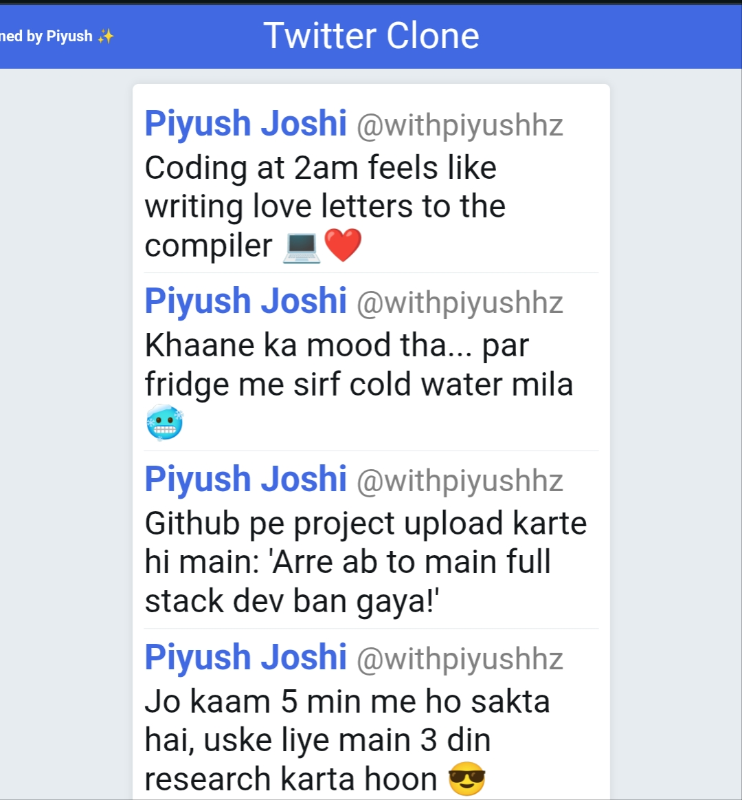

# 🐦 Twitter Clone (Frontend)

A simple, responsive **Twitter Clone UI** made with HTML, CSS, and JavaScript — built for portfolio showcase.  
Includes **funny/daily-life dummy tweets**, royal blue theme, and smooth flying animation for "Designed by Piyush".

---

## ✨ Features
- **Royal blue + white** modern Twitter-style theme
- Dummy tweets with **funny, relatable text**
- Responsive layout (mobile & desktop ready)
- Flying animation for `"✨ Designed by Piyush ✨"`
- Footer with clickable **Instagram** and **LinkedIn** links

---

## 🖼 Preview
 <!-- Optional: add screenshot link if you upload -->

---

## 🚀 How to Use
1. Download the `index.html` file from this repository.
2. Open it in any browser to preview the UI.
3. Upload to your GitHub to showcase in your portfolio.

---

## 🔗 Connect with Me
- **Instagram:** [@withpiyushhz](https://instagram.com/withpiyushhz)
- **LinkedIn:** [Piyush Joshi](https://www.linkedin.com/in/piyush2707/)

---

## 📜 License
This project is open-source and free to use for learning and portfolio purposes.
